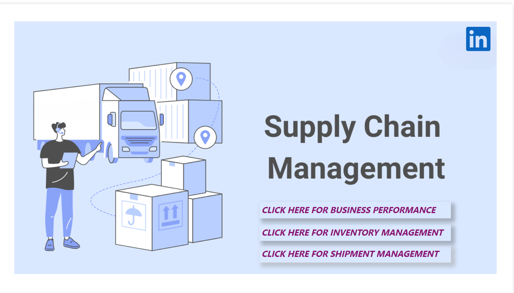

# Supply Chain Analytics - Power BI Project

This Power BI dashboard optimizes supply chain performance and enhances stakeholder engagement by 40%. It features real-time data visualization, performance metrics, and interactive reports to support data-driven decision-making.

## Project Description

The project utilizes a real-world dataset focusing on supply chain analytics. It addresses key shipment and inventory management challenges, analyzes supply chain inefficiencies, and creates insightful dashboards to inform business stakeholders about potential problems and propose structural business improvements.

## Methodology

### Business Demand Analysis
- **Requirements**: Create dashboards to analyze the business problem and improve the supply chain’s efficiency.
- **Method**: Descriptive, exploratory, and diagnostic analysis.
- **Tools Used**: Python (Data preprocessing, data cleaning, EDA, inventory segmentation), Power BI (Dashboard).

### Key Dashboards:
- **$ Sales Manager**: Overview and tracking of customer demand and product sales.
    - **Dashboard**: Displays overall business performance including sales, profit, orders, customers, best-selling products, etc.
  
- **$ Inventory Manager**: Control of inventory flow, including order fulfillment, storing, and distribution.
    - **Dashboard**: Shows inventory management metrics, such as warehouse inventory, number of customer orders, storing costs, etc.
  
- **$ Shipping Manager**: Oversees daily shipping and distribution operations to customers.
    - **Dashboard**: Tracks shipping operations, including orders, location, timing, and delayed shipments.

Overall, the target is to create an interactive dashboard to summarize the research on supply chain issues and suggest solutions.

## Data Preprocessing

### Data Overview
The dataset provides three key tables: **order_and_shipment**, **inventory**, and **fulfillment**. These tables contain:
- **Customer**: General customer info, including identifiers and addresses.
- **Order**: Information about each order, including date, product, quantity, and order value.
- **Shipment**: Shipping information, including shipping dates and modes.
- **Product**: Product details, including name, category, and department.
- **Warehouse Inventory**: Inventory management details, including monthly inventory, location, storage costs, and order fulfillment.

### Data Cleaning
- Dropped unnecessary columns.
- Fixed datatypes of columns.
- Removed special characters in customer country column.
- Checked for missing and duplicate values.
- Resolved inconsistencies between order and inventory tables (e.g., product names).
- Cleaned shipping time errors (negative and unusually large values).

### Feature Creation
- **Date Features**: Created datetime features from day, month, and year.
- **Shipping Features**: Created "Late Shipment" and "Late Shipment Rate" indicators.
- **Business Performance Features**: Net Sales, Unit Price, Profit Margin, and Storage Cost.

## Exploratory Data Analysis (EDA)

### Key Questions and Insights:
#### Business Performance:
1. Net sales, profit, and profit margin by company.
2. Monthly trends for net sales, profit, and order counts.
3. Product departments with the highest sales and orders.

#### Customer:
1. Distribution of customers by country and market.
2. Patterns in customer buying behavior over time.

#### Product:
1. Most preferred and profitable product categories and names.

#### Inventory:
1. Product departments with the highest warehouse inventory and storage costs.
2. Trends in inventory cost and warehouse storage over time.

#### Shipment:
1. Shipment modes and on-time delivery rates.
2. Late shipment trends and rates across product departments and geographical locations.

### Insights from EDA:
- **Business Performance**: 
    - Net Sales and Profit have increased from 2015 to 2017.
    - Fluctuations in net profit margins between 60%-70%.
    - Top-selling product categories include Fan Shop, Apparel, Golf, Footwear, and Outdoors.
  
- **Inventory Management**:
    - Warehousing inventory and storage costs increased yearly from 2015 to 2017.
    - Apparel and Fan Shop departments account for higher storage costs and inventory levels.
  
- **Shipment Management**:
    - Fan Shop, Fitness, and Discs Shop show the highest on-time delivery rates.
    - USA, Mexico, France, and Brazil have significant late shipment issues.
    - Late shipment rates peaked in 2015 Q1 but gradually decreased by Q4 2017.

### Key Performance Indicators (KPIs) Tracked:
- **Net Sales & Profit Margins**: Tracking overall financial health.
- **Late Shipment Rate**: Identifying areas of shipment delays and inefficiencies.
- **Inventory Turnover**: Measures how quickly inventory is being sold and replaced.
- **Order Fulfillment Time**: How efficiently orders are processed from inventory to shipment.

## Results and Recommendations

### Business Downturn/Deficiencies Identified:
- **Variability in Net Sales and Profit Margins**: Suggests a need for more consistent strategies.
- **Dependency on Key Departments**: Reduces the flexibility of the supply chain.

### Inventory Management Deficiencies:
- **High Inventory Cost per Unit**: Needs better cost control and optimization.
- **High Storage Costs for Specific Departments**: Requires better resource management.

### Shipment Management Deficiencies:
- **High Late Shipment Rate**: Significant delays affecting customer satisfaction.
- **Geographical Shipment Delays**: Delays concentrated in certain regions.

### Recommendations:
1. **Enhance Shipment Tracking and Management**: Implement better tracking systems to reduce delays.
2. **Optimize Inventory Levels and Storage Costs**: More efficient inventory management.
3. **Diversify Product Department Strategies**: Spread risk across different departments.
4. **Improve Cost Management**: Tighten control on both inventory and storage costs.

## Dashboards

Below are the key dashboards generated from the project:

1. **Welcome Dashboard**  
   

2. **Business Performance Dashboard**  
   

3. **Inventory Management Dashboard**  
   

4. **Shipment Management Dashboard**  
   

## License

This project is licensed under the MIT License. See the LICENSE file for more details.

## Contact

For any questions or feedback, feel free to reach out via LinkedIn:  
[LinkedIn - Ritesh Meshram](https://www.linkedin.com/in/ritesh-meshram/)

